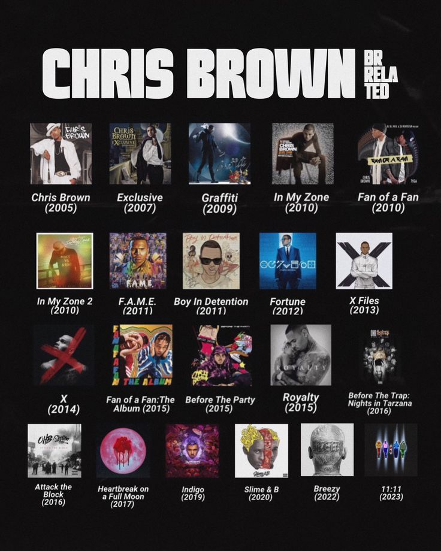

<p align="center">
  
</p>

# Chris Brown Streaming Analysis: 20-Year Career Resilience & Audio Evolution

## 📌 Project Overview
This project explores how Chris Brown has maintained commercial and streaming success across a two-decade career despite recurring public controversies. By examining audio characteristics (danceability, valence, tempo) alongside streaming volume and historical chart movements, this analysis maps out his commercial evolution and eras of peak engagement.

---

## ❓ Research Questions
* How did the 2009 Rihanna incident visibly impact his streaming numbers and chart performance?
* What audio features define each of his career eras?
* What made *Indigo* his commercial peak?
* How does *F.A.M.E* compare to *11:11*, given both won Grammys in completely different music streaming eras?
* Is public criticism reflected in early streaming datasets, or are consumer listening patterns indicating sustained fan support?

---

## 📊 Data Sources & Collection Process

### Datasets Profile


| File Name | Data Source | Inventory Contents |
| :--- | :--- | :--- |
| `chrisbrown_song_spotify_streams_kworb_20260520` | Kworb.net | Song-level Spotify streaming tallies |
| `chrisbrown_album_spotify_streams_kworb_20260520` | Kworb.net | Album-level Spotify streaming aggregate totals |
| `chrisbrown_youtube_song_views_20260520` | Kworb.net | Lifespan YouTube video view counts |
| `chrisbrown_album_peakchartpositions_wikipedia` | Wikipedia | Peak chart performance across 11 countries & RIAA certification data |
| `chrisbrown_billboard_hot100_billboard_20260520` | Billboard.com | Song-level Hot 100 histories (debut dates, peak ranks, weeks active) |
| `cleaned_dataset`<br>`spotify_dataset`<br>`datos_merged_1986_2023` | Kaggle | Historical audio profile features (danceability, energy, valence, tempo) |
| `chrisbrown_discography_with_genres` | Self-Compiled | Structured discography of 13 albums, 333+ tracks, labels, and genres |

### Collection Methodology
* **Streaming & Views Data:** Manually extracted from Kworb.net streaming tables into Excel format as a static snapshot.
* **Chart Positions:** Captured from Wikipedia's curated discographies to establish permanent historical markers.
* **Billboard Metrics:** Scraped from Billboard.com historical archives tracking 125 unique charting songs.
* **Genre Classifications:** Built from the ground up by verifying tracklists on YouTube/Wikipedia alongside AI-assisted structural classification.

---

## 🛠️ Data Ingestion Pipeline & Cleaning Process

### Pre-Processing (Excel Layer)
* **Hyperlink Removal:** Cleaned raw URL elements using Excel structural functions.
* **Footnote Pruning:** Erased Wikipedia text footnotes (e.g., `[1]`, `[2]`) via bulk text formatting.
* **Calculated Fields:** Split messy label cells into discrete data items using `MID` and `FIND` string search methods.
* **Standardization:** Fixed date columns into a predictable `dd/mm/yyyy` sequence and expanded shortened country codes into full text names.

### Database Ingestion Strategy (DBeaver & PostgreSQL)
To circumvent common file import errors, the raw data files were pushed into PostgreSQL via DBeaver using a specialized fallback layout:
* **Bulk Layout Overrides:** Standard `VARCHAR(50)` allocations were completely bypassed. Column mapping templates were globally adapted to `TEXT` formatting to prevent structural truncation crashes on extended track names or nested collaborations.
* **Array-Type Resolution:** Hidden internal pointer assignments (such as the default `_text` array typing) were explicitly flattened to simple database `TEXT` elements to successfully process arbitrary text formatting in titles (like `[From The Motion Picture...]`).
* **Header Alignment:** File configurations were reassigned from `none` to a dedicated `top` position structure to force DBeaver to register row zero entries as system column labels rather than target row data.
* **Dynamic Data Standardization:** Null text entries, empty cells, and placeholder strings (`'-'`) were systematically targeted for standardization. Multi-column SQL conditional wrappers were developed using `NULLIF` and `TRIM` functions to execute uniform, high-speed data cleaning inside the database layer:

```sql
UPDATE your_table_name
SET 
    column_one = NULLIF(TRIM(column_one), '-'),
    column_two = NULLIF(TRIM(column_two), '-')
WHERE 
    column_one = '-' OR column_two = '-';
```

---

## ⚠️ Data Limitations & Constraints
* **Audio Feature Thresholds:** Spotify API endpoint updates limit available song metrics down to roughly 40 specific tracks.
* **Snapshot Timelines:** Streaming data values are locked as static values and do not capture historical acceleration patterns.
* **Evolving Data Footprints:** Streaming evaluations for new albums remain highly constrained due to their fresh release horizons close to the collection cutoff dates.
